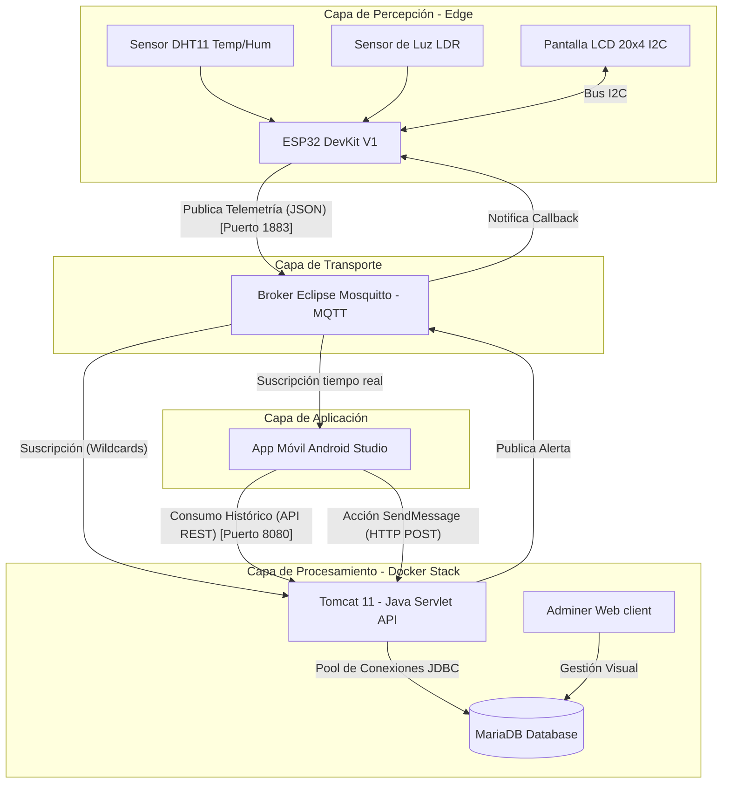

# AtmoCity 🌆 - Sistema IoT y Arquitectura de Microservicios para Smart Cities

[](https://www.docker.com/)
[](https://openjdk.org/)
[](https://developer.android.com/studio)
[](https://www.arduino.cc/)
[](https://azure.microsoft.com/)

**AtmoCity** es un sistema integral y funcional de gestión urbana y monitorización ambiental para ciudades inteligentes (*Smart Cities*). El proyecto implementa una arquitectura modular distribuida de tres capas que integra hardware de bajo coste (nodos IoT con ESP32), protocolos de mensajería asíncronos y ligeros (MQTT), una infraestructura de middleware contenerizada basada en microservicios (Docker) y una interfaz de usuario móvil nativa (Android) con capacidades de geolocalización e interacción en tiempo real.

Desarrollado como proyecto final de la asignatura **Computación Ubicua** en la **Universidad de Alcalá (UAH)**.

---

## 📐 Arquitectura General del Sistema

El sistema implementa una comunicación híbrida bidireccional:
1. **Flujo Ascendente (Monitorización):** Lecturas ambientales en tiempo real transmitidas desde los nodos sensores mediante **MQTT** e ingestadas por un servidor **Tomcat** para su persistencia en **MariaDB** y consumo en la aplicación **Android**.
2. **Flujo Descendente (Actuación):** Envío de alertas y mensajes personalizados desde la aplicación móvil hacia las pantallas físicas urbanas a través de una llamada a la **API REST** de Tomcat que publica en el bróker MQTT.



---

## 🛠️ Detalles de Implementación por Capas

### 1. Capa de Percepción (Hardware & Firmware)
Ubicada en la carpeta `arduino_calibrado/`.
* **Hardware:** Microcontrolador **ESP32 DevKit V1** conectado a un sensor **DHT11** (pin GPIO 17), un sensor **LDR** de luminosidad (pin GPIO 25 configurado como `INPUT_PULLUP`) y una pantalla **LCD 20x4** a través del bus **I2C** (pines GPIO 21-SDA y 22-SCL).
* **Simulación Multi-Calle:** Para testear la escalabilidad del sistema sin necesidad de múltiples placas físicas, el firmware simula el despliegue de 3 estaciones de visualización en ubicaciones reales (Montes Albares, Pedro Gumiel y Paseo del Prado), inyectando variaciones y publicando de forma alternada bajo sus respectivos IDs.
* **Actuador Bidireccional:** El ESP32 reacciona a mensajes remotos mediante una función *callback* de MQTT, limpiando la pantalla para mostrar notificaciones urgentes del ayuntamiento e iniciando un parpadeo de alerta en la retroiluminación.

### 2. Capa de Infraestructura y Procesado (Docker & Backend)
Ubicada en la carpeta `COM UB PL2 bueno/`.
Gestionada por un entorno contenerizado orquestado mediante **Docker Compose** en una red privada aislada (`app-network`):
* **Broker MQTT (Eclipse Mosquitto):** Desacopla emisores y receptores, sirviendo en el puerto 1883.
* **Base de Datos (MariaDB):** Modelo de datos normalizado (Tablas: *Calle, Dispositivo y Telemetria*) para persistir lecturas históricas. Cuenta con volumen asignado para evitar pérdida de datos y un script de inicialización (`init.sql`).
* **Servidor Tomcat 11 (Java 17):** Creado mediante un **Dockerfile multi-etapa** (etapa de compilación Maven y ejecución Tomcat). Utiliza un pool de conexiones JDBC administrado vía context-pooling (JNDI) para inserciones ultrarrápidas de telemetría y consultas analíticas a través de una API REST segura.
* **Adminer:** Gestor web ligero mapeado en el puerto 8081 para inspección y depuración directa de las tablas SQL.

### 3. Capa de Aplicación (Android Client)
Ubicada en la carpeta `Ubicua_ExampleAndroid-master/`.
* Aplicación nativa desarrollada en **Android Studio (Java)**.
* **Google Maps API:** Muestra la geolocalización de las distintas pantallas en el mapa a partir de las coordenadas latitud/longitud obtenidas del servidor.
* **Históricos y Gráficas:** Consume la API REST del servidor para consultar el historial de mediciones ambientales filtrado por rango de fechas, renderizando gráficas de evolución de temperatura y humedad.
* **Monitorización en Vivo:** Suscrita de manera asíncrona al bróker MQTT (mediante tópicos con comodines como `Sensors/+/sensor/telemetry`), lo que permite actualizar la UI instantáneamente al recibir lecturas cada 10 segundos.
* **Consola de Operador:** Interfaz para que gestores municipales escriban textos informativos y los envíen a la pantalla física en menos de 200ms de latencia.

---

## 🚀 Guía de Despliegue y Ejecución

### Requisitos previos
* [Docker Desktop](https://www.docker.com/products/docker-desktop/) instalado y ejecutándose.
* [Android Studio](https://developer.android.com/studio) para la compilación de la app.
* [Arduino IDE](https://www.arduino.cc/en/software) (con soporte para placas ESP32 instalado).

---

### Paso 1: Levantar la Infraestructura (Docker)
1. Abre tu terminal en el directorio `COM UB PL2 bueno/`.
2. Ejecuta el siguiente comando para compilar e iniciar los servicios en segundo plano:
   ```bash
   docker-compose up --build -d
   ```
3. Verifica que los 4 contenedores están saludables:
   ```bash
   docker ps
   ```
4. Podrás acceder al gestor de bases de datos desde el navegador en `http://localhost:8081` (Adminer).

---

### Paso 2: Configurar y Desplegar el ESP32
1. Abre el archivo `arduino_calibrado/arduino_calibrado.ino` en el **Arduino IDE**.
2. Instala las librerías necesarias: `PubSubClient`, `DHT sensor library`, `LiquidCrystal_I2C` y `ArduinoJson`.
3. Configura tus credenciales WiFi y la IP local de la máquina que ejecuta Docker en las variables correspondientes del código:
   ```cpp
   const char* ssid = "TU_WIFI_SSID";
   const char* password = "TU_WIFI_PASSWORD";
   const char* mqtt_server = "IP_DE_TU_PC_CON_DOCKER";
   ```
4. Conecta tu ESP32 por USB y realiza la subida del programa. Abre el Monitor Serie para verificar la conexión contra el Broker.

---

### Paso 3: Lanzar la Aplicación Android
1. Abre la carpeta `Ubicua_ExampleAndroid-master/` en **Android Studio**.
2. Espera a que se sincronicen los archivos Gradle.
3. Asegúrate de configurar la dirección IP de tu servidor backend Tomcat (la misma IP de tu PC) en la clase de configuración de red de la aplicación (usualmente en la URL base del cliente HTTP/Retrofit).
4. Configura tu API Key de Google Maps en el manifiesto para el correcto funcionamiento de los mapas.
5. Ejecuta la aplicación en un dispositivo físico o emulador conectado a la misma red WiFi.

---

## 📊 Planificación y Conclusiones
El proyecto demuestra que es viable integrar dispositivos físicos económicos del mundo maker (ESP32 y sensores analógicos) con infraestructura de nivel empresarial (*Enterprise*) utilizando contenedores y colas de mensajería industriales. El sistema cuenta con mecanismos de tolerancia a fallos tales como reconexión automática en el Edge Node, verificación de salud de servicios dependientes en Docker, y pools de conexiones eficientes que mitigan el coste computacional y de red.
